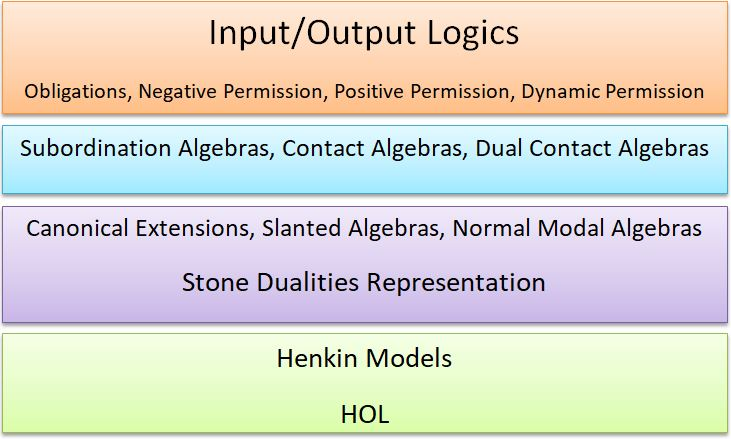

# Algebraic I/O Logic Implementation in HOL

Welcome to the repository for implementing Input/Output (I/O) Logic in Higher-Order Logic (HOL). This project builds upon the algebraic approach to I/O logic as described in the paper:

_De Domenico, A., Farjami, A., Manoorkar, K., Palmigiano, A., Panettiere, M., & Wang, X. (2024). Obligations and permissions, algebraically. arXiv preprint arXiv:2403.03148._

## Progress and Approach

### Implementation Overview

The following layers are crucial for implementing the full picture of I/O logics in HOL:

This implementation builds on David Fuenmayor's work on basic topology, specifically:
- `base.thy`
- `boolean_algebra.thy`
- `boolean_algebra_infinitary.thy`

This approach leverages the Stone representation of Boolean algebra as an algebra of sets.

## Key Points for Implementation

1. **Canonical Extensions**:
    - Definition 4.5 is implemented in HOL, but proving the Stone representation theorem remains challenging. For our purposes, the theorem isn't essential since we work directly with an algebra of sets.

2. **Extending the Stone Theorem**:
    - We primarily need Proposition 2.6, Proposition 2.7, and Lemma 4.7 for extending the Stone theorem to I/O logic and slanted algebra representations. While Propositions 2.6 and 2.7 are partially implemented, their utility for modal translations of I/O logics is uncertain. Current experiments rely on the definitions of slanted and Boolean algebras.

3. **Focus on Subordination and Contact Algebra**:
    - Currently, our focus is on subordination algebra and contact algebra. The rules characterizing contact algebra are interpreted in two ways: derivability and non-derivability (contraposition). In the paper, we use the non-derivability interpretation, while in Isabelle, we use the derivability interpretation.

## Challenges and Future Work

The initial implementation appears promising, but the effectiveness of duality techniques for modal translations of various I/O logics in theorem provers and Isabelle remains unclear. Additionally, automating I/O logic implementation is motivated by the non-monotonicity of permission.

## Repository Structure

- `base.thy`
- `boolean_algebra.thy`
- `boolean_algebra_infinitary.thy`
- `subordination_algebra.thy`
- `slanted_obligation.thy`
- `contac_algebra.thy`
- `slanted_permission`
- `static_permission`
- `dynamic_permission`

Feel free to explore the files and contribute to the project.

## Contributing

We welcome contributions and discussions on this long-term project on I/O logics. Please open an issue or pull request for any suggestions or improvements.

## License

This project is licensed under the MIT License - see the [LICENSE](LICENSE) file for details.
